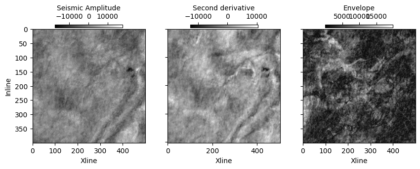

# Welcome!

Throughout this tutorial you will analyze a dataset and compute seismic attributes using Python. You will learn:
- Load seismic blocks using [segyio](https://github.com/equinor/segyio).
- Create seismic attributes

# The Problem

**Lithofacies analysis** is a crucial step in seismic interpretation. For this purpose, different seismic attributes are employed to improve our understanding about seismic data.

In this notebook, we use [`d2geo`](https://github.com/dudley-fitzgerald/d2geo) to compute some of the most known seimic attributes. This can allow us to perform an efficient facies analysis.


Let's getting started!

# Getting the Dataset

The Society of Exploration Geophysics (SEG) made available an [online repository](https://wiki.seg.org/wiki/Open_data) with major surveys from onshore and offshore areas. 

For this tutorial, we will use a seismic block that is not available for public use. However, you can download a seismic dataset from SEG datasets.


# Data Preparation

Importing Python dependencies.


```python
# Basic imports.
import os
import segyio
import sys
import time
import numpy as np

# Dataframe libraries for attribute computation.
import dask.array as da
import dask.dataframe as ddf

import matplotlib.pyplot as plt
```

## Reading Seismic Cubes

Let's first define the input file directory:


```python
from nogit import INPUT_FILE
print(f"Type of INPUT_FILE: {type(INPUT_FILE).__name__}")
```

    Type of INPUT_FILE: str


`INPUT_FILE` has type of  str as the path to the segy data.

We load the `segy` file using [**segyio**](https://github.com/equinor/segyio).
This is a python package published by Equinor.

Let's make a preliminary check on the seismic cubes using the **segyio** library and verify that number of inlines, crosslines, and time slices match the reference we have on SEG repository:


```python
def inspect_seismic_cubes(file_name):
    segy_file = segyio.open(file_name)
    iline_start = int(segy_file.ilines[0])
    iline_end = int(segy_file.ilines[-1])
    iline_offset = int(segy_file.ilines[1] - segy_file.ilines[0])

    xline_start = int(segy_file.xlines[0])
    xline_end = int(segy_file.xlines[-1])
    xline_offset = int(segy_file.xlines[1] - segy_file.xlines[0])

    time_start = int(segy_file.samples[0])
    time_end = int(segy_file.samples[-1])
    time_offset = int(segy_file.samples[1] - segy_file.samples[0])
        
    print("File: {} \n"
          "Inline range: [{}, {}]. Offset: {}\n"
          "Crossline range: [{}, {}]. Offset: {}\n"
          "Time range: [{}, {}]. Offset: {}".format(os.path.basename(file_name),
                                                       iline_start, iline_end, iline_offset, 
                                                       xline_start, xline_end, xline_offset, 
                                                       time_start, time_end, time_offset))
    metadata = {
        'inline': (iline_start, iline_end, iline_offset),
        'crossline': (xline_start, xline_end, xline_offset),
        'time': (time_start, time_end, time_offset)
    }
    
    return metadata

metadata = inspect_seismic_cubes(INPUT_FILE)
```

    File: small_cube_channel.segy 
    Inline range: [0, 399]. Offset: 1
    Crossline range: [0, 499]. Offset: 1
    Time range: [0, 99]. Offset: 1


Read the seismic cube as NumPy array. Notice that this may take a while depending on the size of the input volume.


```python
cube = np.array(segyio.tools.cube(INPUT_FILE))
cube = np.ascontiguousarray(cube, 'float32')

print("Original cube dimension:", cube.shape)
```

    Original cube dimension: (400, 500, 100)


### Attribute Computation 

To compute seismic attributes we will use **d2geo** ([git](https://github.com/AmirMardan/d2geo)). This library has Python implementations in **CPU** for the most common attributes used for processing and interpretation.


```python
d2geo_path = os.path.abspath('../..')
sys.path.append(d2geo_path + "/d2geo/attributes")
sys.path.append(d2geo_path)

from d2geo.attributes.CompleTrace import ComplexAttributes
from d2geo.attributes.SignalProcess import SignalProcess

# Calculate envelope of the data 
complex_att = ComplexAttributes()
envelope = np.asarray(complex_att.envelope(cube))

# Calculate second derivative of the data 
signal_process = SignalProcess()
sec_derivative = np.asarray(signal_process.second_derivative(cube))

```

### Visualizing Attributes

We can show a horizon of the raw data and its envelope and second derivative at the $50^{th}$ time step.


```python
time_index = 50

def show_attribute(data: np.ndarray, ax: plt.Axes, title: str):
    im = ax.imshow(data, cmap="gray", aspect="auto")
    points = ax.get_position().get_points()
    dx = np.abs(points[1, 0] - points[0, 0])
    start = points[0, 0] + dx * 0.2
    end = points[1, 0] - dx * 0.2
    final_dx = end - start
    cax = fig.add_axes([start, points[1, 1]+0.01, final_dx, 0.02])
    
    cbar = fig.colorbar(im, cax=cax, orientation="horizontal", 
                        extend="neither", label=title
                    )
    cax.xaxis.set_ticks_position("top")
    cax.xaxis.set_label_position("top")
    ax.set_xlabel("Xline")

fig, ax = plt.subplots(1, 3, figsize=(10, 3))
show_attribute(data=cube[..., time_index],
               ax=ax[0], title="Seismic Amplitude")

show_attribute(data=sec_derivative[..., time_index],
               ax=ax[1], title="Second derivative")
ax[1].set_yticklabels("")
ax[2].set_yticklabels("")
show_attribute(data=envelope[..., time_index],
               ax=ax[2], title="Envelope")
ax[0].set_ylabel("Inline");

```


    

    


Some parts of this guide is taken from [NVIDIA's Energy Samples](https://github.com/NVIDIA/energy-sdk)
